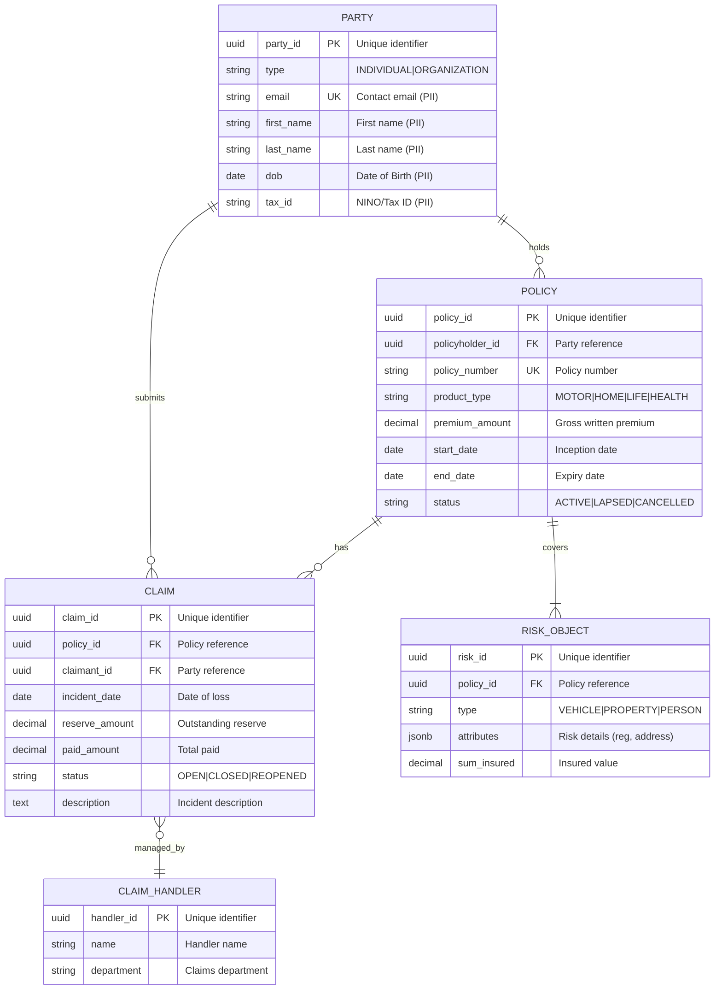

# Data Model: [PROJECT_NAME]

## Document Information

| Field | Value |
|-------|-------|
| **Document ID** | ARC-[PROJECT_ID]-DATA-v[VERSION] |
| **Project** | [PROJECT_NAME] (Project [PROJECT_ID]) |
| **Document Type** | [DOCUMENT_TYPE_NAME] |
| **Classification** | [PUBLIC / OFFICIAL / OFFICIAL-SENSITIVE] |
| **Version** | [VERSION] |
| **Status** | [DRAFT / FINAL / ARCHIVED] |
| **Date** | [YYYY-MM-DD] |
| **Owner** | [OWNER_NAME_AND_ROLE] |

## Revision History

| Version | Date | Author | Changes |
|---------|------|--------|---------|
| [VERSION] | [DATE] | ArcKit AI | Initial creation from `/arckit.[COMMAND]` command |

---

## Executive Summary

### Overview
[2-3 paragraphs explaining the purpose of this data model, what business domain it covers, and how it supports the project requirements]

### Model Statistics
- **Total Entities**: [X] entities defined (E-001 through E-XXX)
- **Total Attributes**: [Y] attributes across all entities
- **Total Relationships**: [Z] relationships mapped
- **Data Classification**:
  - 🟢 Public: [X] entities
  - 🟡 Internal: [X] entities
  - 🟠 Confidential: [X] entities ([X] contain PII)
  - 🔴 Restricted: [X] entities (health data, criminal convictions, etc.)

### Compliance Summary
- **GDPR/DPA 2018 Status**: [COMPLIANT | NEEDS_DPIA | GAPS_IDENTIFIED]
- **PII Entities**: [X] entities contain personally identifiable information
- **Data Protection Impact Assessment (DPIA)**: [REQUIRED | NOT_REQUIRED | COMPLETED]
- **Data Retention**: [Longest retention period] (driven by [regulation/requirement])
- **Cross-Border Transfers**: [YES | NO] (UK to [countries])

### Key Data Governance Stakeholders
- **Data Owner (Business)**: [Name/Role] - Accountable for data quality and usage
- **Data Steward**: [Name/Role] - Responsible for data governance policies
- **Data Custodian (Technical)**: [Name/Role] - Manages data storage and security
- **Data Protection Officer**: [Name/Role] - Ensures privacy compliance

---

## Visual Entity-Relationship Diagram (ERD)

**Diagram Notes**:
- **Cardinality**: `||` = exactly one, `o{` = zero or more, `|{` = one or more
- **Primary Keys (PK)**: Uniquely identify each record
- **Foreign Keys (FK)**: Reference other entities
- **Unique Keys (UK)**: Must be unique but not primary identifier

---

## Entity Catalog

### Entity E-001: PARTY (Policyholder/Insured)

**Description**: Represents an individual or organization involved in an insurance contract.

**Source Requirements**:
- [DR-001]: Capture policyholder details
- [DR-002]: KYC/AML checks

**Business Context**: Central entity for Single View of Customer.

**Data Ownership**:
- **Business Owner**: Head of Customer Service
- **Technical Owner**: MDM Team
- **Data Steward**: Customer Data Steward

**Data Classification**: CONFIDENTIAL (contains PII)

**Volume Estimates**:
- **Initial Volume**: [X] records
- **Growth Rate**: [+Y]% per year

**Data Retention**:
- **Active Period**: Life of relationship + X years
- **Total Retention**: [Z] years (driven by Limitation Act/statutory requirements)

#### Attributes

| Attribute | Type | Required | PII | Description | Validation Rules |
|-----------|------|----------|-----|-------------|------------------|
| party_id | UUID | Yes | No | Unique identifier | UUID v4 |
| type | VARCHAR | Yes | No | Individual or Org | INDIVIDUAL/ORGANIZATION |
| first_name | VARCHAR | Cond | Yes | First Name | Required if Individual |
| last_name | VARCHAR | Cond | Yes | Last Name | Required if Individual |
| dob | DATE | Cond | Yes | Date of Birth | Age >= 18 for policyholder |
| email | VARCHAR | Yes | Yes | Contact Email | Valid email format |

#### Privacy & Compliance

**GDPR/DPA 2018 Considerations**:
- **Legal Basis**: Contract Performance (Policy), Legal Obligation (KYC)
- **Data Subject Rights**: Full rights apply (Access, Rectification, etc.)
- **Special Category Data**: Potential health data if Party is insured Person (Life/Health)

---

### Entity E-002: POLICY

**Description**: An insurance contract between the insurer and the policyholder.

**Source Requirements**:
- [DR-003]: Record policy details
- [DR-004]: Premium calculation

**Data Classification**: CONFIDENTIAL

#### Attributes

| Attribute | Type | Required | PII | Description | Validation Rules |
|-----------|------|----------|-----|-------------|------------------|
| policy_id | UUID | Yes | No | System ID | UUID v4 |
| policy_no | VARCHAR | Yes | No | Business Reference | Unique format |
| start_date | DATE | Yes | No | Inception | <= End Date |
| end_date | DATE | Yes | No | Expiry | >= Start Date |
| premium | DECIMAL | Yes | No | GWP | >= 0 |

---

### Entity E-003: CLAIM

**Description**: A demand by the insured for indemnity under the policy.

**Source Requirements**:
- [DR-005]: Claims processing
- [DR-006]: Reserving

**Data Classification**: CONFIDENTIAL (may contain Special Category Data e.g. Injury)

#### Attributes

| Attribute | Type | Required | PII | Description | Validation Rules |
|-----------|------|----------|-----|-------------|------------------|
| claim_id | UUID | Yes | No | System ID | UUID v4 |
| incident_dt | DATE | Yes | No | Date of Loss | Within policy period |
| reserve | DECIMAL | Yes | No | Estimated Cost | >= 0 |
| status | VARCHAR | Yes | No | Claim Status | Valid lifecycle state |

#### Privacy & Compliance
- **Special Category Data**: Health/Injury details often present. Article 9 condition required (e.g., substantial public interest/insurance purposes).

---

## Data Governance Matrix

| Entity | Business Owner | Data Steward | Sensitivity | Compliance | Quality SLA |
|--------|----------------|--------------|-------------|------------|-------------|
| E-001: Party | CMO | Customer Steward | CONFIDENTIAL | GDPR | 99% accuracy |
| E-002: Policy | CUO | Underwriting Steward | INTERNAL | Solvency 2 | 100% complete |
| E-003: Claim | Claims Dir | Claims Steward | CONFIDENTIAL | GDPR, FCA | 98% accuracy |

---

## Privacy & Compliance

### GDPR / UK Data Protection Act 2018 Compliance

#### PII Inventory
- **E-001 (Party)**: Name, Address, DOB, ID
- **E-003 (Claim)**: Injury details, third party details

#### Legal Basis for Processing
| Entity | Purpose | Legal Basis |
|--------|---------|-------------|
| E-001 | Policy Admin | Contract (Art 6(1)(b)) |
| E-003 | Claims Handling | Contract / Legal Obligation / Substantial Public Interest (Art 9) |

---

## Appendix: Glossary

- **GWP**: Gross Written Premium
- **KYC**: Know Your Customer
- **SCR**: Solvency Capital Requirement
- **PII**: Personally Identifiable Information

---

**Generated by**: ArcKit `/arckit.data-model` command
**Generated on**: [DATE]
**ArcKit Version**: [VERSION]
**Project**: [PROJECT_NAME]
**Model**: [AI_MODEL]
