# UK Government Standards & Policy Framework

## Comprehensive Dependency Diagram

This document maps all UK government functional standards, policy frameworks, and their dependencies.

---

## Complete Framework Diagram

```mermaid
graph TB
    %% ===== FOUNDATIONAL LAYER =====
    subgraph FOUNDATION["🏛️ FOUNDATIONAL GOVERNANCE"]
        MPM["Managing Public Money<br/>(HM Treasury)"]
        GovS001["GovS 001<br/>Government Functions<br/>(Meta-Standard)"]
        GovS002["GovS 002<br/>Project Delivery"]
    end

    %% ===== HM TREASURY FRAMEWORKS =====
    subgraph TREASURY["💼 HM TREASURY FRAMEWORKS"]
        GreenBook["Green Book<br/>Business Case Appraisal<br/>(5-Case Model)"]
        OrangeBook["Orange Book<br/>Risk Management<br/>Principles & Concepts"]
    end

    %% ===== FUNCTIONAL STANDARDS =====
    subgraph GOVS_PEOPLE["👥 PEOPLE & WORKFORCE"]
        GovS003["GovS 003<br/>People (HR)"]
    end

    subgraph GOVS_FINANCE["💰 FINANCIAL MANAGEMENT"]
        GovS006["GovS 006<br/>Finance"]
        GovS014["GovS 014<br/>Debt Management"]
        GovS015["GovS 015<br/>Grants Administration"]
    end

    subgraph GOVS_COMMERCIAL["🤝 COMMERCIAL & PROCUREMENT"]
        GovS008["GovS 008<br/>Commercial<br/>Operating Standards"]
    end

    subgraph GOVS_DIGITAL["💻 DIGITAL & TECHNOLOGY"]
        GovS005["GovS 005<br/>Digital Standard"]
    end

    subgraph GOVS_SECURITY["🔒 SECURITY"]
        GovS007["GovS 007<br/>Security"]
        GovS013["GovS 013<br/>Counter Fraud"]
    end

    subgraph GOVS_ASSURANCE["✅ ASSURANCE & GOVERNANCE"]
        GovS009["GovS 009<br/>Internal Audit"]
        GovS010["GovS 010<br/>Analysis"]
    end

    subgraph GOVS_OTHER["🏢 OTHER FUNCTIONS"]
        GovS004["GovS 004<br/>Property"]
        GovS011["GovS 011<br/>Communication"]
    end

    %% ===== DIGITAL SERVICE LAYER =====
    subgraph DIGITAL_SERVICE["🌐 DIGITAL SERVICE STANDARDS"]
        ServiceStd["GDS Service Standard<br/>14 Points<br/>(Mandatory for Services)"]
        TCoP["Technology Code of Practice<br/>13 Points<br/>(Mandatory for Tech Projects)"]

        subgraph SS_POINTS["Service Standard Points"]
            SS1["1. Understand users"]
            SS2["2. Solve whole problem"]
            SS3["3. Joined up experience"]
            SS4["4. Simple to use"]
            SS5["5. Everyone can use<br/>(Accessibility)"]
            SS6["6. Multidisciplinary team"]
            SS7["7. Agile working"]
            SS8["8. Iterate & improve"]
            SS9["9. Secure & privacy"]
            SS10["10. Define success"]
            SS11["11. Right tools"]
            SS12["12. Open source code"]
            SS13["13. Open standards"]
            SS14["14. Reliable service"]
        end

        subgraph TCOP_POINTS["TCoP Points"]
            T1["1. Define user needs"]
            T2["2. Accessible & inclusive"]
            T3["3. Open & open source"]
            T4["4. Open standards"]
            T5["5. Cloud first"]
            T6["6. Make secure"]
            T7["7. Privacy integral"]
            T8["8. Share, reuse, collaborate"]
            T9["9. Integrate technology"]
            T10["10. Better use of data"]
            T11["11. Define purchasing"]
            T12["12. Sustainable tech"]
            T13["13. Meet Service Standard"]
        end
    end

    %% ===== PROCUREMENT FRAMEWORKS =====
    subgraph PROCUREMENT["📋 PROCUREMENT FRAMEWORKS"]
        DigitalMarket["Digital Marketplace"]
        GCloud["G-Cloud 14<br/>(IaaS, PaaS, SaaS)<br/>46,000+ services"]
        DOS["Digital Outcomes & Specialists<br/>(Custom Development)"]
        SpendControl["Cabinet Office<br/>Spend Control Process"]
    end

    %% ===== SECURITY FRAMEWORKS =====
    subgraph SECURITY_FRAMEWORKS["🛡️ SECURITY FRAMEWORKS"]
        NCSC_CAF["NCSC Cyber Assessment<br/>Framework (CAF) v4.0<br/>4 Objectives, 14 Principles"]
        CyberEss["Cyber Essentials<br/>5 Technical Controls"]
        UKGDPR["UK GDPR<br/>Data Protection Act 2018"]

        subgraph CAF_STRUCT["CAF Structure"]
            ObjA["Objective A:<br/>Managing Security Risk"]
            ObjB["Objective B:<br/>Protecting Against<br/>Cyber Attack"]
            ObjC["Objective C:<br/>Detecting Cyber<br/>Security Events"]
            ObjD["Objective D:<br/>Minimizing Impact<br/>of Incidents"]

            A1["A1: Governance"]
            A2["A2: Risk Management"]
            A3["A3: Asset Management"]
            A4["A4: Supply Chain"]

            B1["B1: Service Protection"]
            B2["B2: Identity & Access"]
            B3["B3: Data Security"]
            B4["B4: System Security"]
            B5["B5: Resilient Networks"]
            B6["B6: Staff Training"]

            C1["C1: Security Monitoring"]
            C2["C2: Proactive Discovery"]

            D1["D1: Response Planning"]
            D2["D2: Lessons Learned"]
        end
    end

    %% ===== AI & EMERGING TECH =====
    subgraph AI_GOV["🤖 AI & ALGORITHMIC GOVERNANCE"]
        AIPlaybook["UK Government<br/>AI Playbook<br/>(Responsible AI)"]
        ATRS["Algorithmic Transparency<br/>Recording Standard (ATRS)<br/>(Mandatory for AI systems)"]
        AIAssurance["AI Assurance<br/>Techniques"]
    end

    %% ===== ACCESSIBILITY & INCLUSION =====
    subgraph ACCESS["♿ ACCESSIBILITY STANDARDS"]
        WCAG["WCAG 2.1 AA<br/>(Web Content Accessibility)<br/>(Mandatory)"]
        InclusiveDesign["Inclusive Design<br/>Principles"]
    end

    %% ===== DATA & PRIVACY =====
    subgraph DATA_PRIVACY["🔐 DATA & PRIVACY"]
        DPIAProcess["Data Protection<br/>Impact Assessment<br/>(DPIA)"]
        ICO9["ICO 9-Criteria<br/>Screening"]
        DataEthics["Data Ethics<br/>Framework"]
    end

    %% ===== PROJECT PHASES =====
    subgraph PHASES["📊 GDS AGILE DELIVERY PHASES"]
        Discovery["Discovery<br/>(Research problem)"]
        Alpha["Alpha<br/>(Prototype solutions)"]
        Beta["Beta<br/>(Build & test)"]
        Live["Live<br/>(Operate & improve)"]
    end

    %% ===== ASSESSMENT GATES =====
    subgraph GATES["🚦 ASSESSMENT GATES"]
        AlphaAssess["Alpha Assessment<br/>(Service Standard)"]
        BetaAssess["Beta Assessment<br/>(Service Standard)"]
        LiveAssess["Live Assessment<br/>(Service Standard)"]
    end

    %% =========================================
    %% DEPENDENCIES - FOUNDATIONAL
    %% =========================================

    MPM --> GovS001
    MPM --> GovS006
    MPM --> GreenBook

    GovS001 --> GovS002
    GovS001 --> GovS003
    GovS001 --> GovS004
    GovS001 --> GovS005
    GovS001 --> GovS006
    GovS001 --> GovS007
    GovS001 --> GovS008
    GovS001 --> GovS009
    GovS001 --> GovS010
    GovS001 --> GovS011
    GovS001 --> GovS013
    GovS001 --> GovS014
    GovS001 --> GovS015

    %% =========================================
    %% DEPENDENCIES - BUSINESS CASE & RISK
    %% =========================================

    GovS002 --> GreenBook
    GovS002 --> OrangeBook
    GreenBook --> OrangeBook

    %% =========================================
    %% DEPENDENCIES - DIGITAL STANDARDS
    %% =========================================

    GovS005 --> ServiceStd
    GovS005 --> TCoP

    TCoP --> T13
    T13 --> ServiceStd

    ServiceStd --> SS1
    ServiceStd --> SS2
    ServiceStd --> SS3
    ServiceStd --> SS4
    ServiceStd --> SS5
    ServiceStd --> SS6
    ServiceStd --> SS7
    ServiceStd --> SS8
    ServiceStd --> SS9
    ServiceStd --> SS10
    ServiceStd --> SS11
    ServiceStd --> SS12
    ServiceStd --> SS13
    ServiceStd --> SS14

    TCoP --> T1
    TCoP --> T2
    TCoP --> T3
    TCoP --> T4
    TCoP --> T5
    TCoP --> T6
    TCoP --> T7
    TCoP --> T8
    TCoP --> T9
    TCoP --> T10
    TCoP --> T11
    TCoP --> T12

    %% =========================================
    %% DEPENDENCIES - PROCUREMENT
    %% =========================================

    GovS008 --> DigitalMarket
    GovS008 --> SpendControl
    TCoP --> SpendControl
    T11 --> DigitalMarket
    T5 --> GCloud

    DigitalMarket --> GCloud
    DigitalMarket --> DOS

    %% =========================================
    %% DEPENDENCIES - SECURITY
    %% =========================================

    GovS007 --> NCSC_CAF
    GovS007 --> CyberEss
    GovS007 --> UKGDPR

    SS9 --> NCSC_CAF
    SS9 --> UKGDPR
    T6 --> NCSC_CAF
    T7 --> UKGDPR

    NCSC_CAF --> ObjA
    NCSC_CAF --> ObjB
    NCSC_CAF --> ObjC
    NCSC_CAF --> ObjD

    ObjA --> A1
    ObjA --> A2
    ObjA --> A3
    ObjA --> A4

    ObjB --> B1
    ObjB --> B2
    ObjB --> B3
    ObjB --> B4
    ObjB --> B5
    ObjB --> B6

    ObjC --> C1
    ObjC --> C2

    ObjD --> D1
    ObjD --> D2

    A2 --> OrangeBook

    %% =========================================
    %% DEPENDENCIES - DATA & PRIVACY
    %% =========================================

    UKGDPR --> DPIAProcess
    DPIAProcess --> ICO9
    B3 --> UKGDPR
    T10 --> DataEthics

    %% =========================================
    %% DEPENDENCIES - AI GOVERNANCE
    %% =========================================

    AIPlaybook --> ATRS
    AIPlaybook --> AIAssurance
    AIPlaybook --> DataEthics
    T10 --> AIPlaybook
    SS9 --> AIPlaybook
    UKGDPR --> AIPlaybook

    %% =========================================
    %% DEPENDENCIES - ACCESSIBILITY
    %% =========================================

    SS5 --> WCAG
    SS5 --> InclusiveDesign
    T2 --> WCAG
    T2 --> InclusiveDesign

    %% =========================================
    %% DEPENDENCIES - PHASES & GATES
    %% =========================================

    ServiceStd --> Discovery
    ServiceStd --> Alpha
    ServiceStd --> Beta
    ServiceStd --> Live

    Discovery --> Alpha
    Alpha --> AlphaAssess
    AlphaAssess --> Beta
    Beta --> BetaAssess
    BetaAssess --> Live
    Live --> LiveAssess

    %% =========================================
    %% DEPENDENCIES - FINANCIAL
    %% =========================================

    GovS006 --> GreenBook
    GovS014 --> GovS006
    GovS015 --> GovS006
    GovS015 --> GreenBook

    %% =========================================
    %% STYLING
    %% =========================================

    classDef foundational fill:#e1f5fe,stroke:#01579b,stroke-width:3px
    classDef functional fill:#f3e5f5,stroke:#4a148c,stroke-width:2px
    classDef digital fill:#e8f5e9,stroke:#1b5e20,stroke-width:2px
    classDef security fill:#fff3e0,stroke:#e65100,stroke-width:2px
    classDef procurement fill:#fce4ec,stroke:#880e4f,stroke-width:2px
    classDef ai fill:#e0f2f1,stroke:#004d40,stroke-width:2px
    classDef treasury fill:#fff9c4,stroke:#f57f17,stroke-width:2px
    classDef phases fill:#ede7f6,stroke:#311b92,stroke-width:2px

    class MPM,GovS001,GovS002 foundational
    class GovS003,GovS004,GovS005,GovS006,GovS007,GovS008,GovS009,GovS010,GovS011,GovS013,GovS014,GovS015 functional
    class ServiceStd,TCoP,SS1,SS2,SS3,SS4,SS5,SS6,SS7,SS8,SS9,SS10,SS11,SS12,SS13,SS14,T1,T2,T3,T4,T5,T6,T7,T8,T9,T10,T11,T12,T13 digital
    class GovS007,NCSC_CAF,CyberEss,UKGDPR,ObjA,ObjB,ObjC,ObjD,A1,A2,A3,A4,B1,B2,B3,B4,B5,B6,C1,C2,D1,D2 security
    class GovS008,DigitalMarket,GCloud,DOS,SpendControl procurement
    class AIPlaybook,ATRS,AIAssurance ai
    class GreenBook,OrangeBook treasury
    class Discovery,Alpha,Beta,Live,AlphaAssess,BetaAssess,LiveAssess phases
```



---

## Dependency Matrix Summary

### Tier 0: Foundational Governance
**These drive everything else:**
- **Managing Public Money (HM Treasury)** - Financial governance foundation
- **GovS 001: Government Functions** - Meta-standard defining how functions are managed
- **GovS 002: Project Delivery** - Project management framework

### Tier 1: Business Case & Risk Management
**Required for all projects/programmes:**
- **Green Book** - 5-case business case model (Strategic, Economic, Commercial, Financial, Management)
- **Orange Book** - Risk management principles and processes

### Tier 2: Functional Standards (14 Standards)
**Domain-specific mandatory standards:**

| Code | Function | Key Dependencies |
|------|----------|------------------|
| GovS 003 | People (HR) | GovS 001 |
| GovS 004 | Property | GovS 001 |
| GovS 005 | Digital | GovS 001, Service Standard, TCoP |
| GovS 006 | Finance | Managing Public Money, Green Book |
| GovS 007 | Security | GovS 001, NCSC CAF, Cyber Essentials |
| GovS 008 | Commercial | GovS 001, Digital Marketplace |
| GovS 009 | Internal Audit | GovS 001 |
| GovS 010 | Analysis | GovS 001 |
| GovS 011 | Communication | GovS 001 |
| GovS 013 | Counter Fraud | GovS 007 |
| GovS 014 | Debt | GovS 006 |
| GovS 015 | Grants | GovS 006, Green Book |

### Tier 3: Digital Service Standards
**Mandatory for digital services and technology:**

#### GDS Service Standard (14 Points)
| Point | Requirement | Key Dependencies |
|-------|-------------|------------------|
| 1 | Understand users | User research |
| 2 | Solve whole problem | Service design |
| 3 | Joined up experience | Multi-channel |
| 4 | Simple to use | UX design |
| 5 | Everyone can use | WCAG 2.1 AA (mandatory) |
| 6 | Multidisciplinary team | GovS 003 |
| 7 | Agile ways of working | GovS 002 |
| 8 | Iterate & improve | Continuous delivery |
| 9 | Secure & privacy | NCSC CAF, UK GDPR, DPIA |
| 10 | Define success | Performance metrics |
| 11 | Right tools | TCoP |
| 12 | Open source code | Open standards |
| 13 | Open standards | Interoperability |
| 14 | Reliable service | SLAs, monitoring |

#### Technology Code of Practice (13 Points)
| Point | Requirement | Key Dependencies |
|-------|-------------|------------------|
| 1 | Define user needs | Service Standard Point 1 |
| 2 | Accessible & inclusive | WCAG 2.1 AA |
| 3 | Open & open source | Service Standard Point 12 |
| 4 | Open standards | Service Standard Point 13 |
| 5 | Cloud first | G-Cloud framework |
| 6 | Make secure | NCSC CAF, Cyber Essentials |
| 7 | Privacy integral | UK GDPR, DPIA |
| 8 | Share, reuse, collaborate | GDS components |
| 9 | Integrate technology | Legacy systems |
| 10 | Better use of data | Data Ethics Framework |
| 11 | Define purchasing | Digital Marketplace |
| 12 | Sustainable tech | Environmental standards |
| 13 | Meet Service Standard | Service Standard (14 points) |

### Tier 4: Security Frameworks
**Mandatory for security and resilience:**

#### NCSC Cyber Assessment Framework (CAF) v4.0

**4 Objectives:**
- **A**: Managing Security Risk (4 principles)
- **B**: Protecting Against Cyber Attack (6 principles)
- **C**: Detecting Cyber Security Events (2 principles)
- **D**: Minimizing Impact of Incidents (2 principles)

**14 Principles:**
| Objective | Principle | Requirement |
|-----------|-----------|-------------|
| A | A1: Governance | Security governance structure |
| A | A2: Risk Management | Risk assessment (Orange Book) |
| A | A3: Asset Management | Asset inventory & classification |
| A | A4: Supply Chain | Third-party risk management |
| B | B1: Service Protection | Security policies & processes |
| B | B2: Identity & Access | IAM, MFA, least privilege |
| B | B3: Data Security | Encryption, classification (UK GDPR) |
| B | B4: System Security | Secure configuration, patching |
| B | B5: Resilient Networks | Network segmentation, DDoS protection |
| B | B6: Staff Training | Security awareness training |
| C | C1: Security Monitoring | SIEM, log management |
| C | C2: Proactive Discovery | Threat hunting, vulnerability scanning |
| D | D1: Response Planning | Incident response plan, BCP |
| D | D2: Lessons Learned | Post-incident review |

**Other Security Standards:**
- **Cyber Essentials** - 5 technical controls (firewalls, secure config, access control, malware protection, patching)
- **UK GDPR** - Data protection and privacy
- **DPIA (Data Protection Impact Assessment)** - Mandatory for high-risk processing (ICO 9-criteria screening)

### Tier 5: Procurement Frameworks
**For buying technology and services:**

| Framework | Purpose | Services | Suppliers |
|-----------|---------|----------|-----------|
| **G-Cloud 14** | Cloud services (IaaS, PaaS, SaaS) | 46,000+ | 4,000+ (90% SMEs) |
| **Digital Outcomes & Specialists (DOS)** | Custom development, specialists | Bespoke solutions | Vetted suppliers |
| **Cabinet Office Spend Control** | Approval for tech spend | Mandatory approval | All central gov |

### Tier 6: AI & Algorithmic Governance
**For AI/ML systems:**

| Framework | Purpose | Mandatory For |
|-----------|---------|---------------|
| **UK Government AI Playbook** | Responsible AI deployment | AI projects |
| **ATRS (Algorithmic Transparency Recording Standard)** | Document AI systems | Public-facing algorithms |
| **AI Assurance Techniques** | Risk assessment for AI | High-risk AI systems |
| **Data Ethics Framework** | Ethical data use | All data processing |

### Tier 7: Accessibility Standards
**For inclusive design:**

| Standard | Requirement | Level |
|----------|-------------|-------|
| **WCAG 2.1** | Web Content Accessibility Guidelines | AA (mandatory) |
| **Inclusive Design Principles** | Design for diverse users | Best practice |

### Tier 8: GDS Agile Delivery Phases
**Project lifecycle with assessment gates:**

1. **Discovery** - Research the problem (4-8 weeks)
   - No Service Standard assessment

2. **Alpha** - Prototype solutions (6-8 weeks)
   - **Alpha Assessment** (Service Standard 14 points)
   - Lower evidence bar (prove viability)

3. **Beta** - Build and test (Private Beta → Public Beta)
   - **Beta Assessment** (Service Standard 14 points)
   - Higher evidence bar (production readiness, WCAG 2.1 AA audit, security testing)

4. **Live** - Operate and improve
   - **Live Assessment** (Service Standard 14 points)
   - Demonstrate operational excellence, performance data, continuous improvement

---

## Critical Dependency Paths

### Path 1: Digital Service Delivery (Most Common)
```
Managing Public Money → GovS 001 → GovS 002 → Green Book (Business Case) →
GovS 005 (Digital) → Service Standard → Discovery → Alpha Assessment →
Beta Assessment → Live Assessment
```

**Parallel Requirements:**
- **Security**: GovS 007 → NCSC CAF + Cyber Essentials + UK GDPR/DPIA
- **Accessibility**: WCAG 2.1 AA (mandatory for Beta)
- **Technology**: TCoP (13 points, includes "Meet Service Standard")
- **Procurement**: GovS 008 → Digital Marketplace (G-Cloud/DOS)
- **Risk**: Orange Book (throughout)

### Path 2: Technology Project (No Service)
```
Managing Public Money → GovS 001 → GovS 002 → Green Book (Business Case) →
Technology Code of Practice (13 points) → Cabinet Office Spend Control →
Digital Marketplace (G-Cloud/DOS)
```

**Parallel Requirements:**
- **Security**: GovS 007 → NCSC CAF
- **Risk**: Orange Book
- **Procurement**: GovS 008

### Path 3: AI/ML System
```
Managing Public Money → GovS 001 → GovS 002 → Green Book (Business Case) →
GovS 005 (Digital) → Service Standard → UK Government AI Playbook →
ATRS (Mandatory) → AI Assurance → Data Ethics Framework
```

**Parallel Requirements:**
- **Security**: Enhanced (GovS 007 + NCSC CAF + UK GDPR + DPIA mandatory)
- **Accessibility**: WCAG 2.1 AA + explainability requirements
- **Technology**: TCoP Point 10 (Better use of data)
- **Transparency**: ATRS publication required

### Path 4: High-Risk Data Processing
```
Managing Public Money → GovS 001 → GovS 002 → Green Book (Business Case) →
GovS 007 (Security) → UK GDPR → ICO 9-Criteria Screening → DPIA (Mandatory) →
NCSC CAF (B3: Data Security) → Service Standard Point 9
```

**Parallel Requirements:**
- **Risk**: Orange Book (privacy risks)
- **Security**: Enhanced controls
- **Transparency**: If AI involved → ATRS

### Path 5: Critical National Infrastructure (CNI)
```
Managing Public Money → GovS 001 → GovS 002 → Green Book (Business Case) →
GovS 007 (Security) → NCSC CAF (Mandatory) → Cyber Essentials Plus →
Enhanced Security Controls → Continuous Assurance
```

**Parallel Requirements:**
- **Risk**: Orange Book (national security risks)
- **Resilience**: NCSC CAF Objectives C & D (Detection & Response)
- **Supply Chain**: CAF Principle A4 (Supply Chain Security)

---

## Mandatory Compliance Summary

### Always Mandatory (Central Government)
✅ All 14 Functional Standards (GovS 001-015, excluding GovS 012)
✅ Managing Public Money (HM Treasury)
✅ Green Book (Business cases for projects/programmes)
✅ Orange Book (Risk management)

### Mandatory for Digital Services
✅ GDS Service Standard (14 points)
✅ WCAG 2.1 AA (Accessibility)
✅ UK GDPR (Data protection)
✅ DPIA (if high-risk data processing - ICO 9 criteria)

### Mandatory for Technology Projects
✅ Technology Code of Practice (13 points)
✅ Cabinet Office Spend Control
✅ Digital Marketplace (for cloud/digital procurement)

### Mandatory for Security-Sensitive Systems
✅ NCSC Cyber Assessment Framework (CAF) - especially CNI
✅ Cyber Essentials (minimum), Cyber Essentials Plus (higher risk)
✅ UK GDPR

### Mandatory for AI/Algorithmic Systems
✅ UK Government AI Playbook
✅ ATRS (Algorithmic Transparency Recording Standard)
✅ Data Ethics Framework
✅ Enhanced DPIA (algorithmic bias assessment)

### Mandatory Assessments
✅ Service Standard Assessments (Alpha, Beta, Live) - for public-facing services
✅ Spend Control Approval - for technology spend over thresholds
✅ Security Assurance - before Live (NCSC CAF, penetration testing)

---

## Key Observations

### 1. **TCoP Point 13 Creates Hard Dependency**
The Technology Code of Practice explicitly includes "Meet the Service Standard" as point 13, creating a hard dependency between the two frameworks.

### 2. **Layered Security Model**
Security requirements are cumulative:
- Base: GovS 007 (Security Standard)
- Technical: NCSC CAF (14 principles) + Cyber Essentials
- Data: UK GDPR + DPIA
- AI: AI Playbook + ATRS

### 3. **Procurement is Mandated**
TCoP Point 11 "Define your purchasing strategy" drives mandatory use of Digital Marketplace (G-Cloud for cloud services, DOS for custom development).

### 4. **Assessment Gates Create Quality Checkpoints**
Service Standard assessments at Alpha, Beta, and Live create formal checkpoints with escalating evidence requirements.

### 5. **AI Requires Enhanced Governance**
AI systems must comply with ALL standard requirements PLUS:
- AI Playbook
- ATRS (public transparency)
- Enhanced DPIA (algorithmic bias)
- Data Ethics Framework
- Explainability requirements

### 6. **Risk Management Permeates Everything**
Orange Book (risk management) is referenced by:
- Green Book (business case risks)
- GovS 007 (security risks)
- NCSC CAF A2 (risk management principle)
- DPIA (privacy risks)
- AI Playbook (AI risks)

---

## Version

- **Document Date**: 2025-11-05
- **Standards Covered**: 14 GovS Functional Standards + 20+ related frameworks
- **Sources**: GOV.UK, NCSC, GDS, HM Treasury, ICO

## Changelog

### 2025-11-05 - Initial Creation
- Mapped all 14 GovS Functional Standards
- Documented GDS Service Standard (14 points) and TCoP (13 points)
- Mapped NCSC CAF v4.0 (4 objectives, 14 principles)
- Included Digital Marketplace (G-Cloud, DOS)
- Added HM Treasury frameworks (Green Book, Orange Book)
- Documented AI governance (AI Playbook, ATRS)
- Created comprehensive dependency diagram
- Identified 5 critical dependency paths
